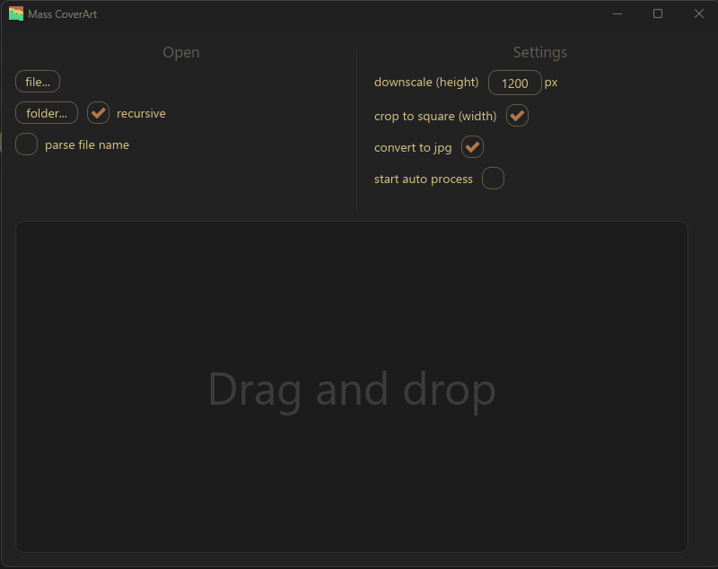

# Mass CoverArt

Cross-platform desktop app for downloading and inserting album art and other tags into audio files

## Features

* Read and (TODO) modify music related metadata
* Fetch and preview album covers based on metadata or a file name
* Group similar images together and sort them for faster search
* Format and insert image into files or (TODO) download them in your library
* Support for various file formats: .mp3, .flac, .mp4, .m4a, .m4p, .m4b, .m4r, .m4v
* Sources supported: 
  * Scrapers: youtube, yotube.music, bandcamp
  * Official API: musicbrainz

## Feedback

If you have a suggestion open an issue or write me on discord: \_daiter\_

## Similar apps
* [Mp3tag](https://www.mp3tag.de)
* [AlbumArt](https://sourceforge.net/p/album-art)

## Implementation details
* Written in Rust and using Iced GUI
* Implements [Miasma](https://github.com/xero/miasma.nvim) theme
* Refereses code from AlbumArt scripts collection
* Use audiotags crate to read metadata
* Use image-compare crate to sort images
